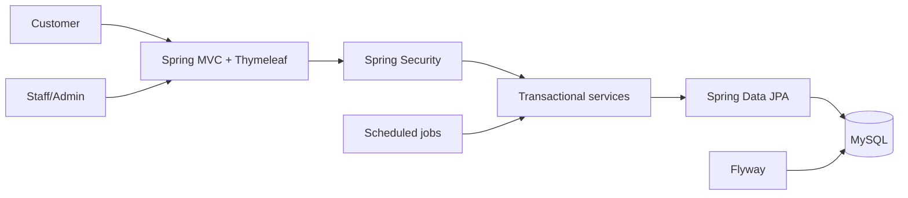
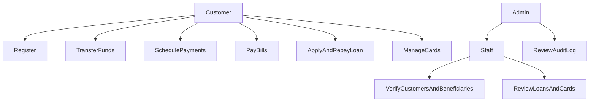
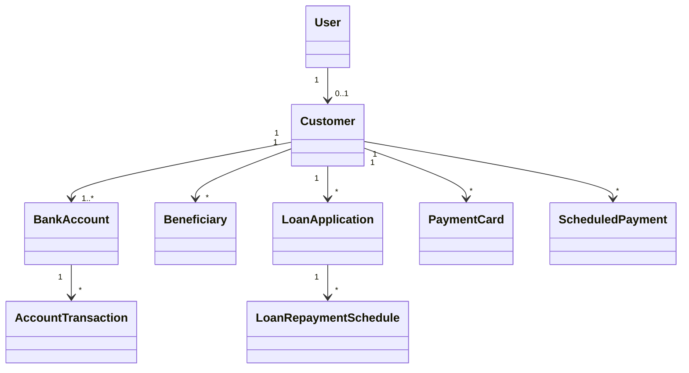
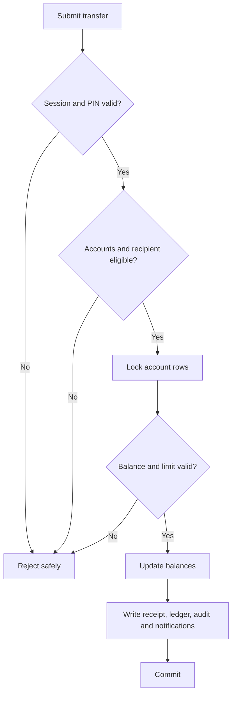

# DigiBank Design Document

## Architecture

DigiBank uses layered Spring MVC. Controllers call transactional services, services enforce rules through repositories, and Flyway owns MySQL schema changes. Spring Security protects routes by role.

## Use cases

## Core class view

## Transfer activity

## Security and ethics

- Passwords/PINs use BCrypt. Card PAN uses AES-256-GCM; HMAC enforces uniqueness and normal views use only the last four digits.
- Secrets come from environment variables. CSRF remains enabled and account ownership is rechecked server-side.
- Stable row-lock ordering protects concurrent balance changes. Audit logs omit PINs, passwords and full sensitive identifiers.
- Safe error pages hide SQL and stack traces. Financial history is preserved rather than destructively deleted.
- Production additionally requires TLS, managed secrets, encrypted backups, retention rules, monitoring and privacy/accessibility review.

## Sprint evidence

1. Customer/account foundation.
2. Beneficiaries and staff verification.
3. Transfers, ledger, statements and notifications.
4. Loans and repayments.
5. Cards and bill payments.
6. Scheduling, security hardening, admin audit, testing and documentation.

